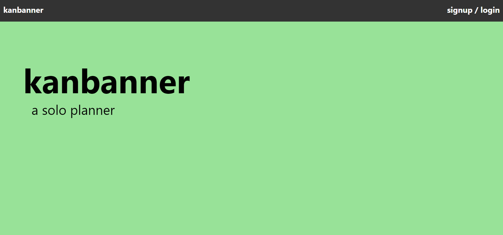
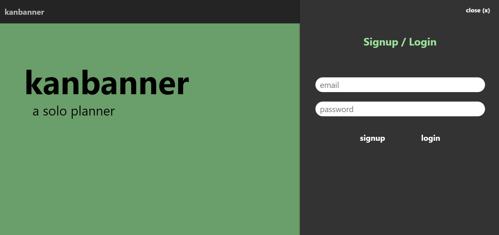
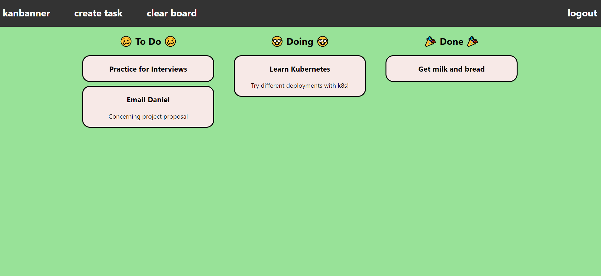
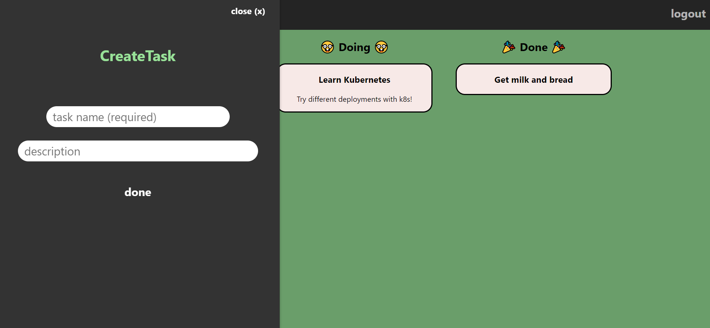

# :pencil2: Kanbanner :pencil2:
This project is a Kanban board built with React. The app was designed to be simple enough so I could try out different methods of deployment, from Firebase to Kubernetes. Check out the [production deployment](https://kanbanner-cbf56.web.app/), achieved through Firebase. Test credentials can be found in the demo section below.

\
&nbsp;

## Demo
Users can signup with a valid email and password. Instead of signing up, you can use these test credentials to login and try ANYTHING out:
- username: `r487wang@uwaterloo.ca`
- password: `12345678`

\
&nbsp;

You'll be met with a three column Kanban board. Try dragging a task to another column. If you want a fresh start, click **clear board**.

\
&nbsp;

Click **create task** and enter a task name. Optionally, enter a task description. The task will appear on the board.

\
&nbsp;

## Deployment
In the repository's [deployment folder](./deployment), there is a [dockerfile](./deployment/Dockerfile) as well as a [docker-compose file](./deployment/docker-compose.yaml) for building the app image and running the container.

Kubernetes manifests can be found in the [kubernetes subfolder](./deployment/kubernetes), where there are configurations for a [Service](./deployment/kubernetes/Service.yaml), a [ReplicaSet](./deployment/kubernetes/ReplicaSet.yaml), and a [Deployment](./deployment/kubernetes/Deployment.yaml). A [bash script](./deployment/kubernetes/deploy.sh) allows these resources to be conveniently created, updated, or deleted.
